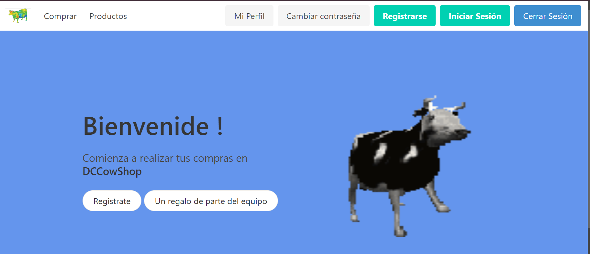
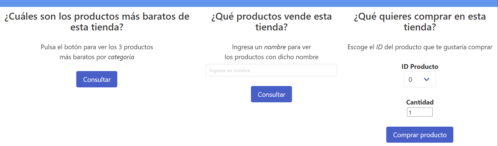
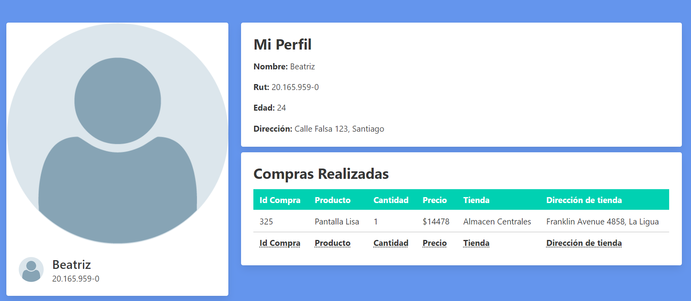
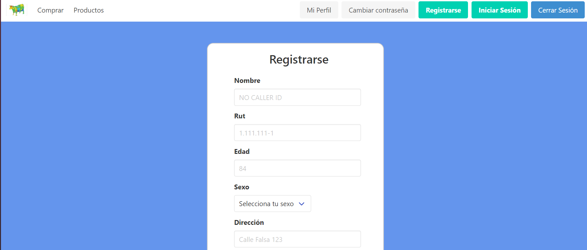

# Multi-Store Platform

This project is a web-based platform developed during the first semester of 2021 for the Database course. The application allows users to browse various stores, view available products, make purchases, register, log in, and view their purchase history. It was built using PHP and PostgreSQL and is designed to run on an Apache server.









## Features

- Browse multiple stores and their available products.
- User registration and login.
- View product details and make purchases.
- View purchase history.

## Requirements

- PHP
- PostgreSQL
- Apache server

## Installation and Setup

1. **Clone the repository**:

```bash
   git clone https://github.com/route-proyect.git
```

2. **Navigate to the project directory**

3. Database setup: Ensure that you have PostgreSQL installed and running. You will need to create a database for the project.

4. Configure data.php:

- Go to the Sites/config directory and open the data.php file.
- Define the `$superuser` and `$superuser_password` variables with your PostgreSQL credentials.

```php
$superuser = 'your_postgresql_superuser';
$superuser_password = 'your_superuser_password';
```

5. **Start the Apache server**: Ensure that Apache is properly installed and configured on your machine.

6. **Run the project:** Place the project folder in your Apache web directory (e.g., /var/www/html/), and start the Apache server.

```bash
   sudo cp -r ~/proyect-route /var/www/html/
    sudo service apache2 start
```

7. **Access the platform:** Open your browser and go to http://localhost/multistore-platform to access the platform.

## Usage

- Register: New users can create an account by clicking the registration link.
- Login: Registered users can log in with their credentials.
- Browse Stores: Users can browse different stores and view available products.
- Purchase: Select a product, add it to your cart, and proceed to purchase.
- View Purchase History: Users can see their past purchases.
